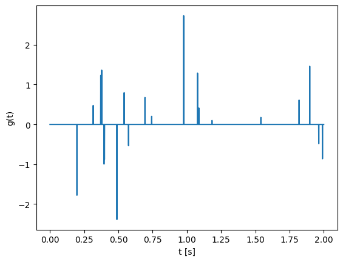
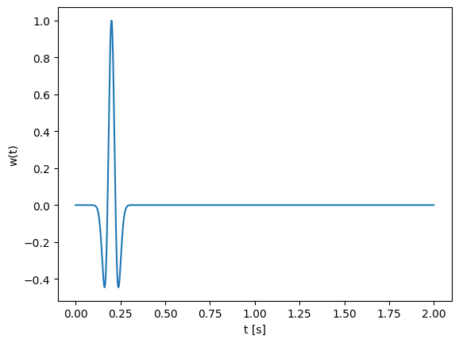
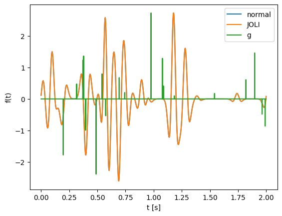

# Exercise 5: From processing to inversion I

# Contents
 - Linear systems
 - SPOT
 - Deconvolotion

## Linear systems
A matrix is represented in Julia as follows


```julia
A = [1 2;3 -1]
```


    2×2 Array{Int64,2}:
     1   2
     3  -1


The transpose of a matrix is obtained via

A'


```julia
A'
```


    2×2 LinearAlgebra.Adjoint{Int64,Array{Int64,2}}:
     1   3
     2  -1


In a similar manner, we can define a column vector as follows


```julia
x = [2; 2]
```


    2-element Array{Int64,1}:
     2
     2


 - Desribe two ways to define a row vector.

Now, consider the matrices


```julia
A1 = [1/sqrt(2) 2/3 sqrt(2)/6;0 1/3 -2*sqrt(2)/3;-1/sqrt(2) 2/3 sqrt(2)/6];
A2 = [0 2 2;2 1 -3;1 0 -2];
A3 = [3 1;1 0;2 1];
A4 = [2 4 3; 1 3 1];
```

# Questions

 - Look at A1'*A1, what kind of matrix is A1? What does this mean?
 - Look at A2*[1;2;3] and A2*[3;1;4], what can you say about the matrix A2?
 - What do you call a linear system defined by matrix A3?
 - What do you call a linear system defined by matrix A4?

If a matrix is invertible, we can explicitly find the inverse with inv

 - find a solution of A1*x = [6;-3;0], is there only one solution? Do you really need inv here?
 - find a solution of A2*x = [4;0;-1], is there only one solution? What characterizes the solution you found?
 - find a solution of A3*x = [5;2;5], is there only one solution? What characterizes the solution you found?
 - find a solution of A4*x = [10;5], is there only one solution? What characterizes the solution you found?


# JOLI

https://github.com/slimgroup/JOLI.jl

The JOLI toolbox gives a way to represent matrices implicitly. A nice example is the Fourier transform. In julia, the Fourier transform of a vector is given by fft(x). We can explicitly construct a matrix representing the Fourier transform as follows


```julia
using FFTW
# dimension
N  = 10
F1 = zeros(Complex{Float64}, N,N)
for k = 1:N
    # construct k-th unit vector
    ek = zeros(N,1)
    ek[k] = 1

    # make column of matrix
    F1[:, k]= fft(ek)
end

```

 - Look at the matrix, what do you notice?
 - Verify that it gives the same result as fft by trying on a vector

We can also define the FFT using JOLI:


```julia
using JOLI
```


```julia
F2  = joDFT(N)
```


    joLinearFunction{Float64,Complex{Float64}}("joDFTp", 10, 10, getfield(JOLI, Symbol("##837#853")){DataType,Tuple{Int64},FFTW.cFFTWPlan{Complex{Float64},-1,false,1}}(Complex{Float64}, (10,), FFTW forward plan for 10-element array of Complex{Float64}
    (dft-direct-10 "n2fv_10_avx2_128")), Nullable{Function}(getfield(JOLI, Symbol("##240#244")){getfield(JOLI, Symbol("##838#854")){DataType,Tuple{Int64},AbstractFFTs.ScaledPlan{Complex{Float64},FFTW.cFFTWPlan{Complex{Float64},1,false,1},Float64}}}(getfield(JOLI, Symbol("##838#854")){DataType,Tuple{Int64},AbstractFFTs.ScaledPlan{Complex{Float64},FFTW.cFFTWPlan{Complex{Float64},1,false,1},Float64}}(Float64, (10,), 0.1 * FFTW backward plan for 10-element array of Complex{Float64}
    (dft-direct-10 "n2bv_10_avx2_128")))), Nullable{Function}(getfield(JOLI, Symbol("##838#854")){DataType,Tuple{Int64},AbstractFFTs.ScaledPlan{Complex{Float64},FFTW.cFFTWPlan{Complex{Float64},1,false,1},Float64}}(Float64, (10,), 0.1 * FFTW backward plan for 10-element array of Complex{Float64}
    (dft-direct-10 "n2bv_10_avx2_128"))), Nullable{Function}(getfield(JOLI, Symbol("##241#245")){getfield(JOLI, Symbol("##837#853")){DataType,Tuple{Int64},FFTW.cFFTWPlan{Complex{Float64},-1,false,1}}}(getfield(JOLI, Symbol("##837#853")){DataType,Tuple{Int64},FFTW.cFFTWPlan{Complex{Float64},-1,false,1}}(Complex{Float64}, (10,), FFTW forward plan for 10-element array of Complex{Float64}
    (dft-direct-10 "n2fv_10_avx2_128")))), true, Nullable{Function}(getfield(JOLI, Symbol("##839#855")){DataType,Tuple{Int64},AbstractFFTs.ScaledPlan{Complex{Float64},FFTW.cFFTWPlan{Complex{Float64},1,false,1},Float64}}(Float64, (10,), 0.1 * FFTW backward plan for 10-element array of Complex{Float64}
    (dft-direct-10 "n2bv_10_avx2_128"))), Nullable{Function}(getfield(JOLI, Symbol("##242#246")){getfield(JOLI, Symbol("##840#856")){DataType,Tuple{Int64},FFTW.cFFTWPlan{Complex{Float64},-1,false,1}}}(getfield(JOLI, Symbol("##840#856")){DataType,Tuple{Int64},FFTW.cFFTWPlan{Complex{Float64},-1,false,1}}(Complex{Float64}, (10,), FFTW forward plan for 10-element array of Complex{Float64}
    (dft-direct-10 "n2fv_10_avx2_128")))), Nullable{Function}(getfield(JOLI, Symbol("##840#856")){DataType,Tuple{Int64},FFTW.cFFTWPlan{Complex{Float64},-1,false,1}}(Complex{Float64}, (10,), FFTW forward plan for 10-element array of Complex{Float64}
    (dft-direct-10 "n2fv_10_avx2_128"))), Nullable{Function}(getfield(JOLI, Symbol("##243#247")){getfield(JOLI, Symbol("##839#855")){DataType,Tuple{Int64},AbstractFFTs.ScaledPlan{Complex{Float64},FFTW.cFFTWPlan{Complex{Float64},1,false,1},Float64}}}(getfield(JOLI, Symbol("##839#855")){DataType,Tuple{Int64},AbstractFFTs.ScaledPlan{Complex{Float64},FFTW.cFFTWPlan{Complex{Float64},1,false,1},Float64}}(Float64, (10,), 0.1 * FFTW backward plan for 10-element array of Complex{Float64}
    (dft-direct-10 "n2bv_10_avx2_128")))), true)


```julia
varinfo(r"F1"), varinfo(r"F2")
```


    (| name |      size | summary                         |
    |:---- | ---------:|:------------------------------- |
    | F1   | 1.602 KiB | 10×10 Array{Complex{Float64},2} |
    , | name |      size | summary                                    |
    |:---- | ---------:|:------------------------------------------ |
    | F2   | 566 bytes | joLinearFunction{Float64,Complex{Float64}} |
    )


And this is only a small example! The reason why we want to have such operations behave like matrices is that we can use (some) standard algorithms that where written to work with matrices to work with large scale operations. As an example we use a Gaussian matrix:


```julia
N  = 10000;
# NxN Gaussian matrix
G1 = ones(N, N);
```


```julia
# NxN Gaussian JOLI operator (will represent a different matrix than G1 becuase it is gerenated randomly)
G2 = joOnes(N);
```


```julia
varinfo(r"G1"),varinfo(r"G2")
```


    (| name |        size | summary                      |
    |:---- | -----------:|:---------------------------- |
    | G1   | 762.939 MiB | 10000×10000 Array{Float64,2} |
    , | name |      size | summary                   |
    |:---- | ---------:|:------------------------- |
    | G2   | 246 bytes | joMatrix{Float64,Float64} |
    )


# Deconvolution
We some signal $f(t)$ which is a convolution of some unkown signal $g(t)$ and a known filter $w(t)$. Given $f$ and $w$ we would like to retreive $g$.

For the example we use:

 


```julia
# time axis
t = 0:.001:2';
N = length(t);

# true signal g has approx k spikes with random amplitudes
k = 20;
g = zeros(N,1);
g[rand(1:N, k)] = randn(k,1);

# filter
w = (1 .-2*1e3*(t .-.2).^2).*exp.(-1e3*(t .-.2).^2);

# plot
using PyPlot
figure();
plot(t,g);
xlabel("t [s]");ylabel("g(t)");

figure();
plot(t,w);
xlabel("t [s]");ylabel("w(t)");
```

    ┌ Info: Recompiling stale cache file /home/yzhang3198/.julia/compiled/v1.2/PyPlot/oatAj.ji for PyPlot [d330b81b-6aea-500a-939a-2ce795aea3ee]
    └ @ Base loading.jl:1240








First, we consider the `forward` problem of convolving a signal, using JOLI.

Perform the convolution using the usual julia commands fft, ifft and element-wise multiplication .*.
Creat a JOLI operator to do the same. You can construct an operator to do the multiplication with the filter using joDiag.
 - Compare the results of both.
 - Compare f to g, what do you notice?
 - Assuming that your convolution operator is called C:

Now, construct the signal f using your SPOT operator and add some noise (i.e., f = C*g + 1e-1*randn(N,1)).
Do you think C has a null-space? If so, describe it. (Hint: look at the filter).
Use the adjoint of C as an approximation to the inverse, what does this correspond to and what does the reconstruction look like?
 - Describe how you would invert the system.
 - Use lsqr to do it. (you might need to increase the number of iterations.)
 - Look at the signal that is predicted by your reconstruction, do you see a difference with the true signal?

lsqr will give us a solution that has a small two-norm and explains the data. Alternatively, we can use another solver that will give us a spiky solution and explains the data. This solver is spgl1. Try spgl1(C,f,0,1e-2).

https://github.com/slimgroup/GenSPGL.jl

 - Is this solution closer to the true one?
 - Look at the predicted signal for this solution, do you see a difference with the true signal? Can we really say that this is a better solution? 


```julia
using GenSPGL
# Pkg.clone("https://github.com/slimgroup/GenSPGL.jl")
```

    ┌ Info: Recompiling stale cache file /home/yzhang3198/.julia/compiled/v1.2/GenSPGL/1rFbK.ji for GenSPGL [46767539-6b09-4d43-90af-09e8ecbe3fb9]
    └ @ Base loading.jl:1240


```julia
# FFT convolution
wf = fft(w);
f1 = ifft(wf.*fft(g));
```


```julia
# JOLI operator to perform convolution.
C = joDFT(N)'*joDiag(wf)*joDFT(N);
f2 = C*g;

figure();
plot(t,f1)
plot(t,f2)
plot(t,g);
xlabel("t [s]");ylabel("f(t)");legend(["normal","JOLI", "g"]);
```





```julia
import Pkg;
Pkg.add("IterativeSolvers")
# true signal
f = C*g + 1e-3*randn(N,1);

using IterativeSolvers
gt = lsqr(C, f[:,1], damp=1e0)
```

      Updating registry at `~/.julia/registries/General`
      Updating git-repo `https://github.com/JuliaRegistries/General.git`
    [?25h[1mFetching: [========================================>]  100.0 %.0 %========>                                ]  18.1 %36.1 %======================>                  ]  54.2 %]  72.2 %.0 %  Updating registry at `~/.julia/registries/SLIMregistryJL`
      Updating git-repo `https://github.com/slimgroup/SLIMregistryJL.git`
    [?25l[?25h Resolving package versions...
     Installed WoodburyMatrices ─ v0.5.1
     Installed LaTeXStrings ───── v1.1.0
     Installed Polynomials ────── v0.6.1
     Installed DataStructures ─── v0.17.10
     Installed HTTP ───────────── v0.8.11
     Installed GeometryTypes ──── v0.7.9
      Updating `~/.julia/environments/v1.2/Project.toml`
     [no changes]
      Updating `~/.julia/environments/v1.2/Manifest.toml`
      [864edb3b] ↑ DataStructures v0.17.9 ⇒ v0.17.10
      [4d00f742] ↑ GeometryTypes v0.7.7 ⇒ v0.7.9
      [cd3eb016] ↑ HTTP v0.8.8 ⇒ v0.8.11
      [b964fa9f] ↑ LaTeXStrings v1.0.3 ⇒ v1.1.0
      [f27b6e38] ↑ Polynomials v0.6.0 ⇒ v0.6.1
      [efce3f68] ↑ WoodburyMatrices v0.5.0 ⇒ v0.5.1


    2001-element Array{Float64,1}:
     -0.026711020407238755 
     -0.02430458845003921  
     -0.021732823699727465 
     -0.01903229844938986  
     -0.01624223584966089  
     -0.013403650118892975 
     -0.01055844905996742  
     -0.007748521131999995 
     -0.005014829434839256 
     -0.0023965345046637054
      6.983318839339968e-5 
      0.0023511316695113424
      0.004418279428671759 
      ⋮                    
     -0.03568039275658377  
     -0.036367167385888986 
     -0.036839448269382076 
     -0.03707193278694536  
     -0.037043681395473434 
     -0.036738716043437224 
     -0.03614649561688319  
     -0.035262256601174845 
     -0.03408721073472233  
     -0.03262859519536173  
     -0.030899574695754523 
     -0.028918998669671653 


```julia
using LinearAlgebra
# Solve
opts = spgOptions(optTol = 1e-10,
                  verbosity = 1)

#gtt, r, grads, info = spgl1(C, vec(f), tau = 0., sigma = norm(f - C*gt));
```


```julia
GenSPGL.spgOptions(1, 1, 100000, 3, 1.0e-6, 1.0e-6, 1.0e-10, 0.0001, 1.0e-16, 100000.0, 2, Inf, false, Nullable{Bool}(), Inf, [1], false, 3, 1, 10000, false, GenSPGL.NormL1_project, GenSPGL.NormL1_primal, GenSPGL.NormL1_dual, GenSPGL.funLS, false, false, false)
```
